# Assignment_kotak


## Task 

 ```
Refer to this repo: https://github.com/ranupratapsingh/benchmarks

This repo contains 4 small backend applications in different languages.

 
Pick any 2 of them, and create deployment scripts for them in HA setup.

Assume AWS as cloud.
Number of server instances should be configurable
Load balancer(e.g. AWS ALB) configuration to be part of assignment
You Should cover
Server provisioning
Config management
Subsequent deployment
You can do it without without kuberntes.
 

Try ensuring best practices & quality(ease of understanding and well documented).
 ```

## Approach

Use AWS as a Cloud Provider

Use Terraform for infrastructure provisioning with s3 as backend and dynamodb.

Use Jenkins for CI/CD

Use docker for containerization

AWS EKS as orchestration tool

Application Routing via nginx-ingress


### Used below command for infra provisioning

Initializes a Terraform working directory by downloading providers and initializing backend.
```bash
$ terraform init
```
Checks the Terraform configuration files for syntax errors and other basic errors.
```bash
$ terraform validate
```
Rewrites Terraform configuration files to a canonical format.
```bash
$ terraform fmt
```

Creates an execution plan showing what actions Terraform will take to apply the configuration
```bash
$ terraform plan 
```

Applies the changes specified in the Terraform configuration, creating or modifying resources.

```bash
$ terraform apply 
```

Destroys the resources created by Terraform, effectively terminating the infrastructure.
```bash
$ terraform destroy
```

## Infra Creation


### Backend creation

This backend will create an S3 bucket with versioning enabled and a DynamoDB table for managing Terraform state locks

```bash
$ cd benchmark-eks-setup/infra-setup/backend
$ terraform init
$ terraform plan
$ terraform apply
```
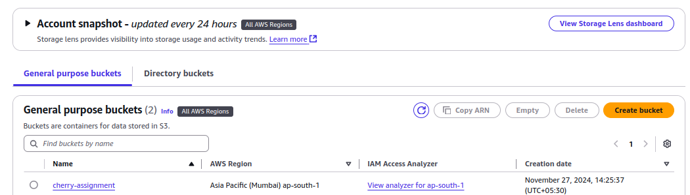

### Create VPC

The VPC where application will be deployed. It will create both public and private subnet.

```bash
$ cd kotak-assignment/infra-setup/vpc
$ terraform init
$ terraform plan
$ terraform apply
```
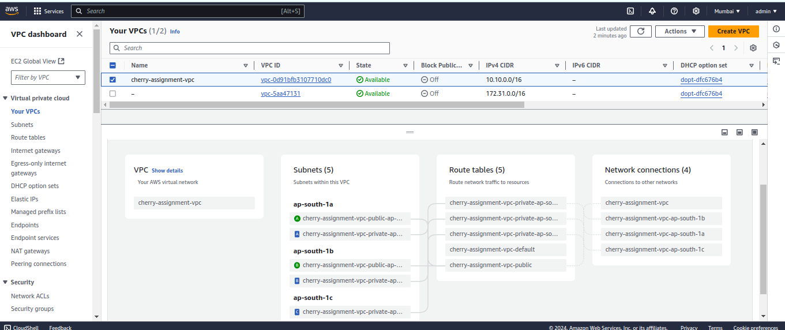

### Create Bastion Server

Bastion service to access the cluster

```bash
$ cd kotak-assignment/infra-setup/jenkins
$ terraform init
$ terraform plan
$ terraform apply
```
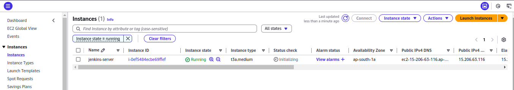

### Create EKS Cluster

Creating eks cluster with 1 worker node. 

```bash
$ cd benchmark-eks-setup/infra-setup/eks-infra
$ terraform init
$ terraform plan
$ terraform apply
```
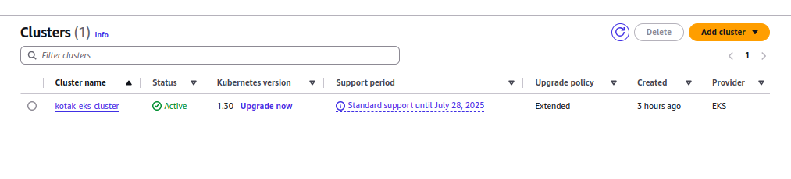

### EKSCTL setup

Run the below command on jenkins server to connect to EKS using kubectl 

```bash
$ aws eks update-kubeconfig --region ap-south-1 --name cluster-name
```

## Dockerization

### Using ecr repo for storing docker images 

Create ecr repo as per app name

### EXPRESS_API

We have created multi stage docker for express API to reduce the overall size of docker image. Also we have created a respective repo 

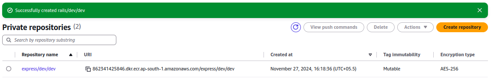

### RAILS

We have created single stage docker for rails.

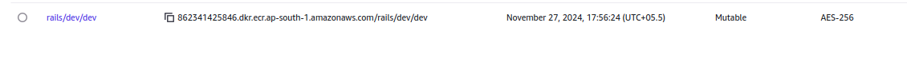

##### Note: For code uniformity Port is changed to 3000 in express_api/config/env.js file


## Seed job
The Seed Job is a foundational job that initializes essential data or configurations for the application, ensuring that the environment is ready for subsequent jobs or workflows to run successfully. This job is typically used to populate databases, configure services, or set up necessary files that other parts of the application depend on.

We have created seed job for express and rails api

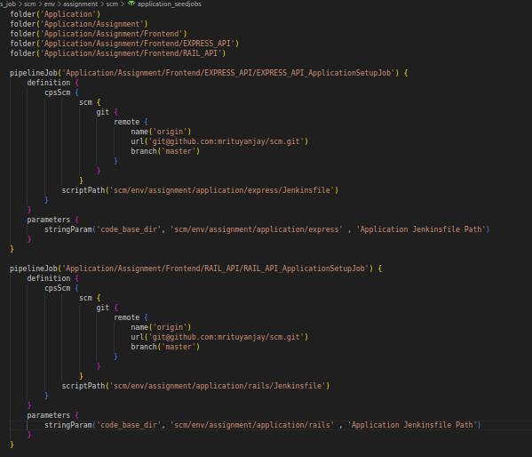
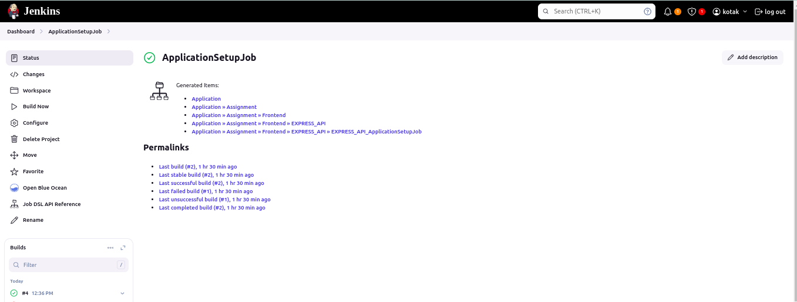


## Jenkins Pipeline
This Jenkins pipeline automates the entire deployment process for both the Express.js and Ruby on Rails API applications. It leverages DevSecOps practices to ensure that security is integrated into every step of the CI/CD pipeline, from code build and test to deployment and monitoring. This pipeline is designed to support an efficient and secure development lifecycle, enabling rapid and reliable delivery of the applications.

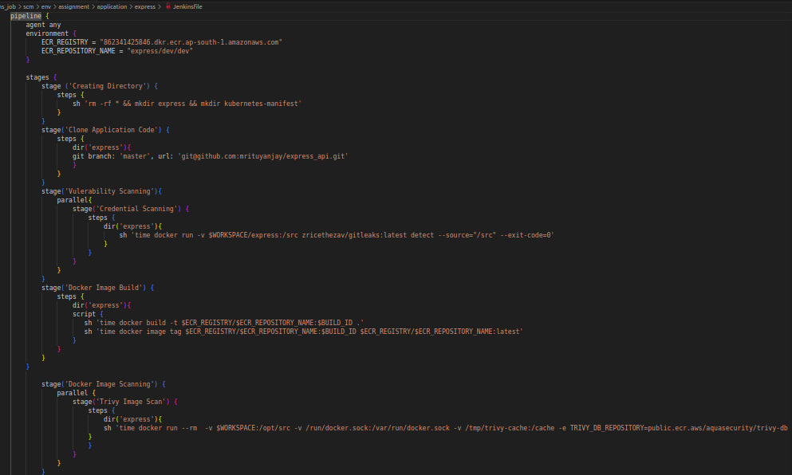
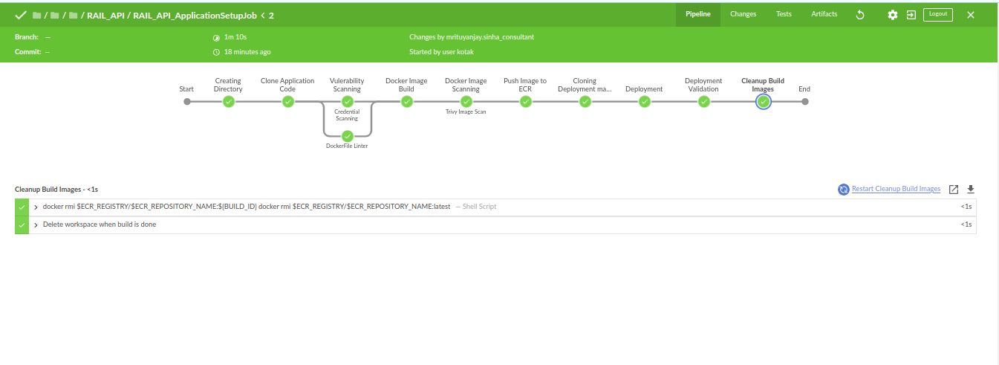


## CI/CD

### Build job url : http://3.111.203.48:8080/blue/organizations/jenkins/Application%2FAssignment%2FFrontend%2FEXPRESS_API%2FEXPRESS_API_ApplicationSetupJob/detail/EXPRESS_API_ApplicationSetupJob/13/pipeline
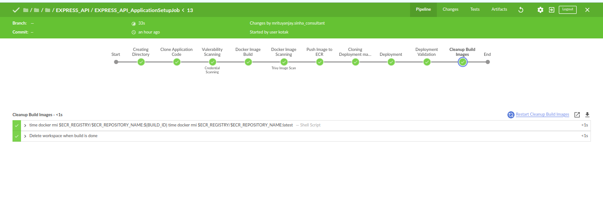


#### Deploy job url: http://3.111.203.48:8080/blue/organizations/jenkins/Application%2FAssignment%2FFrontend%2FRAIL_API%2FRAIL_API_ApplicationSetupJob/detail/RAIL_API_ApplicationSetupJob/2/pipeline/
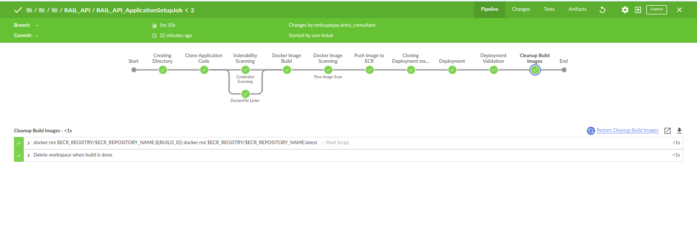


## Kubernetes

####  Application deployed to kubernetes cluster using manifest present in kubernetes folder.

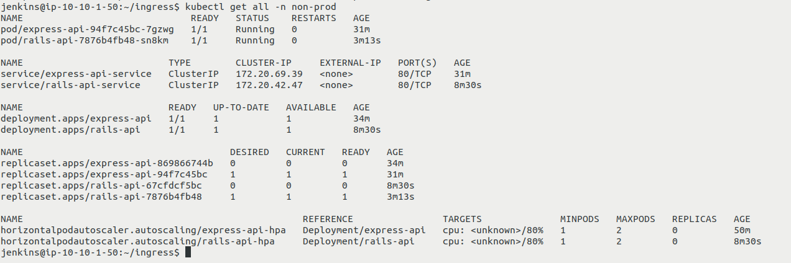


Application is accessible at below endpoints:

###### http://test.express.com/api/benchmarks

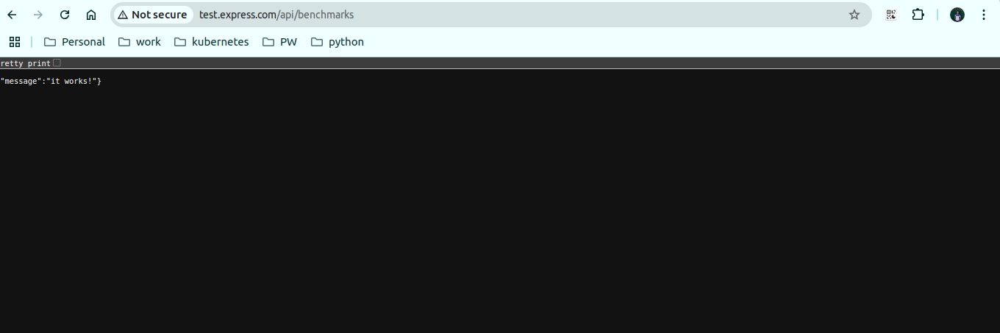

###### http://test.rails.com/


### Note: Since I have not created any DNS please use below host entry to access it on browser

#### 43.204.180.45 test.express.com test.rails.com
